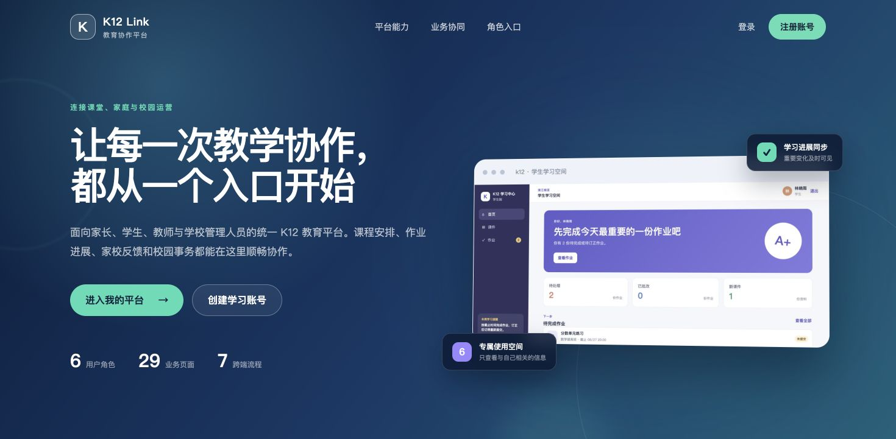
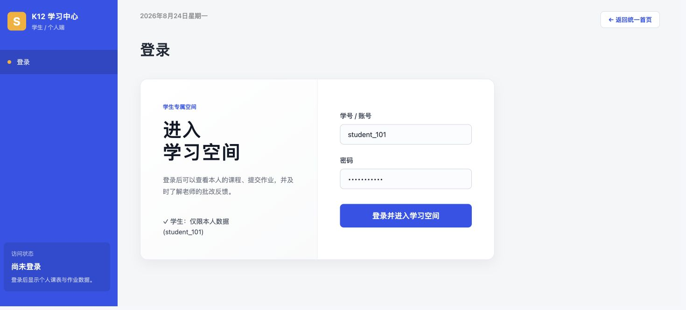

# K12 教育培训综合管理平台

五人协作完成的课程项目。项目本体包含统一入口、家长端、学生网页端、学生 Android APP、学生微信小程序、教师/班主任端、教务/系统后台和统一服务。

公开仓库：[https://github.com/hvelkzj/K12Project](https://github.com/hvelkzj/K12Project)

## 完成状态

| 模块 | 位置 | 状态 |
|---|---|---|
| 统一入口与注册 | `apps/portal-web` | 已完成，连接四个角色工作区 |
| 公共类型与状态 | `packages/shared` | 已完成 |
| 认证、业务 API 与内存数据仓库 | `apps/api` | 已完成 |
| 家长端 | `apps/parent-web` | 7/7 页面已接入 API |
| 学生端 | `apps/student-web` | 7/7 页面已接入 API |
| 学生 APP 与微信小程序 | `apps/student-mobile` | 一套源码，6 个移动页面，已接入统一业务 |
| 教师/班主任端 | `apps/teacher-web` | 7/7 页面已接入 API |
| 教务/系统后台 | `apps/admin-web` | 8/8 页面已接入 API |

已连通账号注册与登录；课件发布和多端阅读；作业发布、提交、订正和批改；学生与家长考勤；调课审批、代课和家长通知；教师反馈、家长异议和工单处理；请假审批与签到；排课维护和账号启停。





## 环境

- Node.js 22.12 或更高版本。
- npm 10 或更高版本。
- macOS 终端和 Windows PowerShell 使用相同的 npm 命令。

## 安装、检查和启动

```bash
node -v
npm -v
npm ci
npm run check
npm run test:load
npm run dev
```

`npm run dev` 同时启动 API、统一入口和四个业务前端：

| 服务 | 地址 |
|---|---|
| API | `http://127.0.0.1:3000` |
| 统一入口 | `http://127.0.0.1:5172` |
| 家长端 | `http://127.0.0.1:5173` |
| 学生端 | `http://127.0.0.1:5174` |
| 教师端 | `http://127.0.0.1:5175` |
| 后台 | `http://127.0.0.1:5176` |

四个业务端的登录页都提供“返回统一首页”入口。部署地址变化时，可在对应前端的 `.env` 中通过 `VITE_PORTAL_URL` 配置统一入口地址。

健康检查：`GET http://127.0.0.1:3000/health`。

API 默认同时监听本机和局域网。启动日志会输出“手机访问地址”，Android 真机与电脑连接同一 Wi-Fi 后，在 APP 登录页的“连接设置”中填写该地址即可。若网络不可达，请求会在 10 秒内结束并提示检查连接，不会一直停留在登录状态。

只启动一个工作区：

```bash
npm run dev:api
npm run dev:portal
npm run dev:parent
npm run dev:student
npm run dev:teacher
npm run dev:admin
```

## Android APP 与微信小程序

```text
npm run build:app
npm run build:mp-weixin
```

- APP 资源输出到 `apps/student-mobile/dist/build/app/`，导入 HBuilderX 后可运行和生成 Android 测试安装包。
- 最终 Android 测试包为 `K12学习空间-Android-0.1.2.apk`；内置版本号 102 与 Camera 模块，SHA-256 为 `482f70027dbcc7d4f7bc3b9f053064a9b973109caa40fc434496f3c43c010099`。
- 微信小程序输出到 `apps/student-mobile/dist/build/mp-weixin/`，可导入微信开发者工具。
- Android 模拟器默认连接 `http://10.0.2.2:3000`；Android 真机在登录页填写服务启动日志中的“手机访问地址”；微信开发者工具默认连接 `http://127.0.0.1:3000`。
- 详细端侧说明见 [学生移动端说明](apps/student-mobile/README.md)。

## 本地测试账号

十三个账号的密码均为 `K12Demo123!`。账号只用于本地课程项目，认证、会话恢复和退出均调用真实 API。完整说明见 [本地测试账号清单](docs/demo-accounts.md)。

| 角色 | 滨江校区 | 城北校区 |
|---|---|---|
| 家长 | `parent_201` | `parent_202` |
| 学生 | `student_101`、`student_102` | `student_103` |
| 任课教师 | `teacher_301` | `teacher_401` |
| 班主任 | `teacher_302`、`teacher_303` | `teacher_402` |
| 教务 | `academic_901` | `academic_902` |
| 系统管理员 | `system_999` | 全校区访问 |

## 注册账号

统一入口提供家长和学生公开注册，调用 `POST /auth/register`：

- 用户名为 4–24 位，以小写字母开头，只使用小写字母、数字或下划线。
- 密码为 8–64 位，同时包含字母和数字。
- 学生注册后默认加入滨江校区六年级 1 班，可立即登录学生端。
- 家长注册后可以登录家长端，初始没有绑定学生。
- 教师、班主任、教务和系统管理员不开放公开注册。

注册账号只保存在当前 API 进程中，API 重启后恢复初始账号。

## 环境变量

默认配置可直接运行。如需修改端口或 API 地址，先复制对应工作区的 `.env.example`。

macOS：

```bash
cp apps/parent-web/.env.example apps/parent-web/.env
```

Windows PowerShell：

```powershell
Copy-Item apps/parent-web/.env.example apps/parent-web/.env
```

其他前端只需替换路径中的工作区名。不要提交 `.env`。

## 数据说明

- 当前运行时使用可注入的进程内数据仓库、注册账号仓库和内存会话。
- API 重启后恢复初始数据，已登录会话失效。
- `apps/api/db/migrations/001_initial.sql` 保留 PostgreSQL 结构，不是当前运行时依赖。
- 作业和课件附件会传输真实文件内容；当前保存在进程内仓库，API 重启后恢复初始附件。

## 有效文档

- [项目分工与完成状态](docs/project-plan.md)
- [模块页面总清单](docs/module-page-inventory.md)
- [核心业务规则](docs/business-rules.md)
- [公共字段与 API 契约](docs/api-field-contract.md)
- [公共数据模型](docs/data-model.md)
- [本地测试账号清单](docs/demo-accounts.md)
- [真实业务验收记录](docs/business-validation-2026-08-24.md)
- [最终 A 交付记录](docs/member-a-final-integration-round-4.md)
- [A 统一入口与注册交付](docs/member-a-portal-registration.md)
- [A 跨端附件与中文状态交付](docs/member-a-business-ui-completion.md)
- [Windows 项目测试记录](docs/windows-test-2026-08-24.md)
- [AI 与 Git 协作规范](AGENTS.md)
