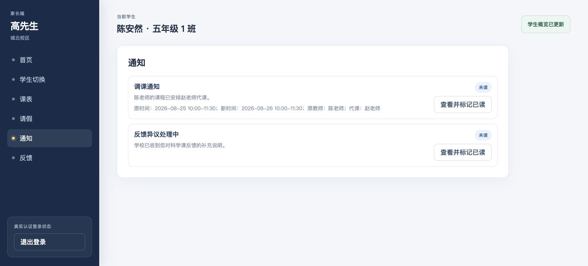
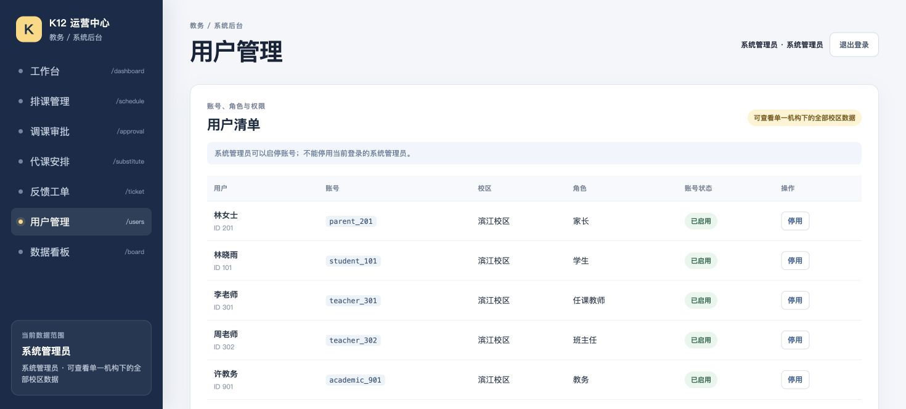

# 真实业务场景验收记录

验收日期：2026-08-24。

## 测试范围

- 六类角色、十三个双校区账号的登录、会话和数据范围。
- 家长请假、教务审批、教师签到联动。
- 教师发布、学生提交、教师批改、学生查看结果。
- 教师反馈、家长异议、教务处理并关闭工单。
- 教师调课、教务审批、同校区代课、家长通知。
- 系统管理员查看两个校区和启停账号。
- `401`、`403`、`404`、`409`、`422`、重复操作、跨校区和历史数据边界。

## 发现并修复的问题

| 问题 | 业务影响 | 修复 |
|---|---|---|
| 后台已有学生 102/103、教师 303/401/402，但认证仓库没有账号 | 用户在后台可见却无法登录 | 统一到公共账号源，补齐十三个可登录账号 |
| 六年级 2 班班主任 303 被标记为普通教师 | 无法获得负责班级的班主任只读范围 | 角色修正为 `HOMEROOM_TEACHER` |
| 家长请假下拉框显示已完成历史课次 | 用户可能为过去课程填写无效请假 | 前端只显示未结束的正常/已调课课次 |
| 只按课次状态判断请假资格 | 状态未及时更新时可能接受过去课次请假 | 后端同时校验课次结束时间 |
| 家长、教师和后台直接显示英文状态或角色代码 | 业务用户无法理解当前处理进度 | 建立公共中文状态映射，四端统一使用中文业务文案 |
| 学生只能看到作业附件元数据 | 无法取得教师布置的学习材料 | 增加认证下载接口和浏览器保存功能 |
| 教师发布作业不能上传附件 | 无法布置包含试卷或图片的作业 | 增加真实文件上传、类型和 10 MB 大小校验 |
| 教师批改页只有分数和评语 | 无法查看学生正文与附件 | 增加提交详情侧栏和学生附件下载 |

## 扩充的初始数据

| 数据 | 数量 | 内容 |
|---|---:|---|
| 校区 | 2 | 滨江校区、城北校区 |
| 班级 | 3 | 两个六年级班、一个五年级班 |
| 可登录账号 | 13 | 六类角色，两个校区均有完整业务角色 |
| 学生 | 3 | 均有可登录账号和班级关系 |
| 课程 | 3 | 数学、英语、科学 |
| 课次 | 7 | 当前课次和已完成历史课次 |
| 课件 | 3 | 三个班级各有可下载课件附件 |
| 初始附件 | 5 | 作业、课件和学生提交均有真实文件字节 |
| 作业/提交 | 6/5 | 待提交、已提交、已批改、待订正均有示例 |
| 签到 | 2 | 正常到课和迟到历史记录 |
| 课后反馈 | 3 | 待家长处理、已确认、已异议 |
| 调课申请 | 2 | 两个校区各一条待审批申请 |
| 通知/工单 | 3/1 | 普通提醒、反馈通知和异议工单 |

## 浏览器验收结果

| 场景 | 结果 |
|---|---|
| 家长 202 登录并只看到学生 103 | 通过 |
| 学生 103 查看科学课件、作业、历史成绩 | 通过 |
| 教师 401 查看城北授课数据和学生提交 | 通过 |
| 班主任 402 查看五年级 1 班但不能写教师 401 的课次 | 通过 |
| 教务 902 只查看城北校区 | 通过 |
| 系统管理员查看两个校区十三个账号 | 通过 |
| 家长请假 → 教务通过 → 教师固定登记 `LEAVE` | 通过 |
| 教师批改提交 4004 → 学生看到 94 分和评语 | 通过 |
| 调课 7002 通过 → 安排赵老师代课 → 家长收到原/新时间和教师 | 通过 |
| 工单 6001 开始处理 → 填写结果关闭 | 通过 |
| 家长反馈状态显示“待家长确认”，不显示英文代码 | 通过 |
| 教师上传附件并发布作业 3007 → 学生立即看到附件下载 | 通过 |
| 教师打开提交 4001 详情 → 查看正文并下载学生附件 | 通过 |
| 教师签到、反馈和后台身份/状态均显示中文 | 通过 |
| 五个业务页面控制台 | 0 error，0 warning |

## 自动化结果

- 全仓 `npm run check`：310 项测试通过、0 失败、0 跳过。
- 真实 HTTP：十三个账号均完成登录、当前用户、退出和旧令牌失效检查。
- 新增附件上传、下载、角色越权、元数据伪造和初始文件引用完整性测试。

## 数据保留

- 扩充的账号、课程、课次、课件、作业、提交、签到、反馈、通知和工单已进入初始数据源，不在测试后删除。
- 浏览器验收产生的作业 3007 和附件保留在当前运行中的内存仓库；API 重启时按项目既有约定恢复上述扩充后的初始数据。
