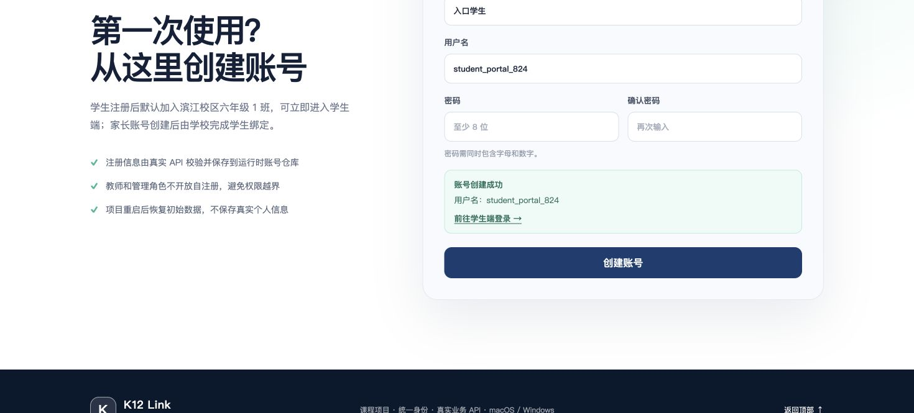

# A 交付记录：统一入口与账号注册

完成日期：2026-08-24

分支：`feature/A-portal-registration`

## 交付内容

- 新增 `apps/portal-web` 统一入口，端口为 `5172`。
- 首页包含平台介绍、业务协同、四个角色入口和账号注册。
- 首页介绍改为家长、学生、教师和学校管理人员易于理解的业务语言，不展示 API、Mock 等开发术语。
- 首页使用项目家长端、学生端、教师端和后台的真实页面截图。
- 家长、学生、教师和后台登录页均增加“返回统一首页”按钮。
- 四个业务端使用 `VITE_PORTAL_URL` 配置统一入口地址，默认值为 `http://127.0.0.1:5172`。
- 新增 `POST /auth/register`，公开创建家长或学生账号。
- 学生注册后加入滨江校区六年级 1 班，可以立即登录并读取课程、课件和作业。
- 家长注册后可以登录，初始绑定学生为空。
- 教师、班主任、教务和系统管理员禁止公开注册。
- 注册账号可在后台账号列表查看、停用；停用时撤销会话。
- 根目录 `npm run dev` 和单独的 `npm run dev:portal` 均包含统一入口。

## 设计取舍

- 参考 EEO 官网的透明顶栏、大幅首屏、能力分区和清晰入口层次。
- 未复制参考站的品牌、文案、图片或代码。
- 所有展示截图来自当前项目本身。
- 注册不自动跨端传递 Token，成功后引导用户到对应工作区登录，避免在 URL 中暴露令牌。
- 注册数据继续使用本项目的内存方案，API 重启后恢复初始数据。

## 注册边界

| 项目 | 规则 |
|---|---|
| 用户名 | 4–24 位，小写字母开头，小写字母/数字/下划线 |
| 姓名 | 2–20 个字符 |
| 密码 | 8–64 位，同时包含字母和数字 |
| 公开角色 | `PARENT`、`STUDENT` |
| 重复用户名 | `409 USERNAME_TAKEN` |
| 非法字段 | `422 VALIDATION_ERROR` |

## 截图

## 公共影响

- `@k12/shared` 新增 `PUBLIC_REGISTRATION_ROLES`、`RegisterRequest` 和 `RegisterResponse`。
- API 新增注册路由、注册校验和运行时账号创建。
- 根工作区新增 `@k12/portal-web`，根锁文件已更新。
- 四个业务端只修改登录页返回入口、展示文案和环境变量示例，未修改业务页面、认证流程或公共字段。

## 验证结果

- 定向类型检查、测试和构建：通过。
- 浏览器首屏、角色入口、学生注册成功、新账号登录和四个登录页返回入口：通过。
- 浏览器控制台：0 个 error，0 个 warning。
- 全仓 `npm run check`：通过，288 项测试通过、0 失败、0 跳过。
- 根目录 `npm run dev`：API、统一入口和四个业务端全部启动。
- `3000`、`5172`、`5173`、`5174`、`5175`、`5176` 均返回 HTTP 200。
- 真实 HTTP 注册、登录和学生概览依次返回 201、200、200。
- 停止根启动后未发现残留监听端口。

Windows PowerShell 仍需运行 `npm ci`、`npm run check` 和 `npm run dev`，确认六个服务地址与停止后的进程状态。
